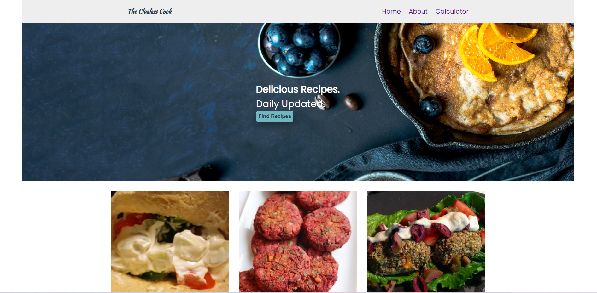
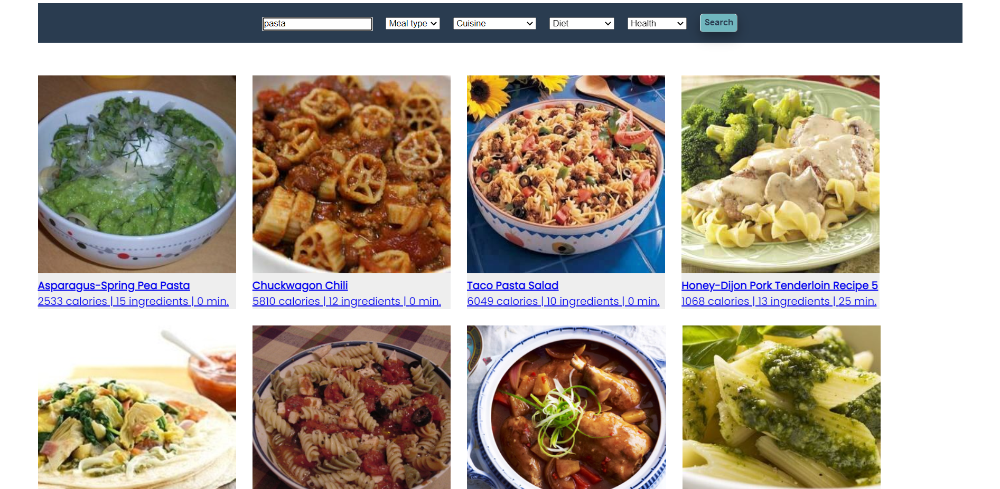
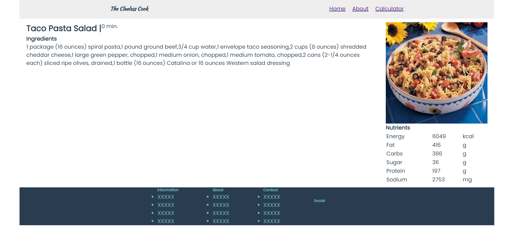
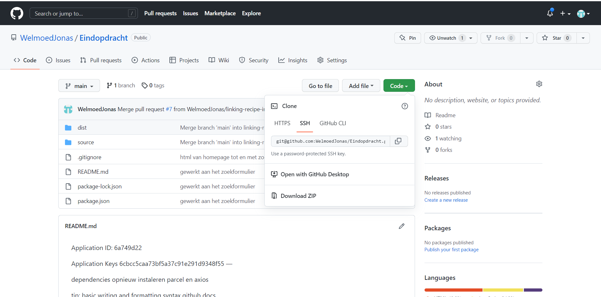
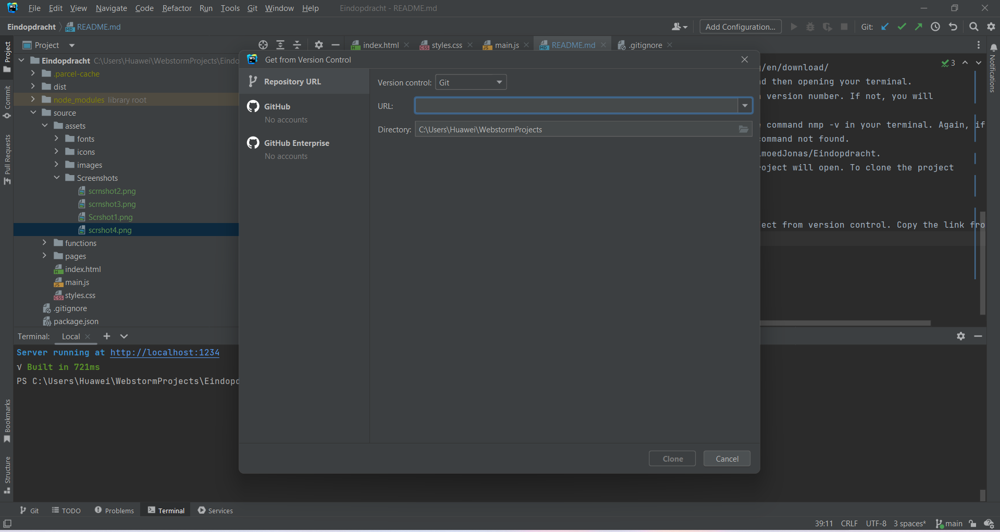

THE CLUELESS COOK 
A web application to easily find recipes

TABLE OF CONTENTS
1. Introduction
2. Technologies
3. Setup
4. Structure of the code

INTRODUCTION
This web application is made to provide easy access to a lot of recipes by fetching data from the Edamam API.
It offers a simple but extensive search function, which randomizes the results. In this way, users always encouter
new recipes. By clicking on one of the recipes, the user wil be automatically linked to the page on which
information about the specific recipe is displayed. It shows a list of ingredients, as well as a table with 
nutrient information.

TECHNOLOGIES
The languages used to create this project are:
* HTML
* CSS
* Javascript 

SETUP
1. Install Node.js in the terminal through this link: https://nodejs.org/en/download/ 
2. Check if the installation was successful by first opening your IDE and then opening your terminal.
   you type: node -v. If the installation was successful, you will see a version number. If not, you will
   see npm: command not found.
3. Check if nmp got correctly installed with installing node by give the command nmp -v in your terminal. Again, if you
   see a version number everything went well, if not you will see npm: command not found.
4. Find the project on GitHub by using this link: https://github.com/WelmoedJonas/Eindopdracht.
5. Press on the green button with Code on it. The window to clone the project will open. To clone the project
   you press SSH and copy the link.
   
   
6. Go back to your IDE. In the menu you go to file --> new --> open project from version control. Copy the link from
   Github in the URL.
   
7. Command in your terminal nmp install.
8. To run the project in your browser, command npm run start.

STRUCTURE OF THE CODE
The main folder is 'source'. In this folder you wil find the index.html, styles.css and main.js files. Those files make
up the basis of the project. Index.html contains the homepage of the application, main.js the basic code and styles .css
all the styling. Further you'll three different folders here, namely 'assets', 'functions', and 'pages'. 
In 'assets' you will find the used fonts, icons and images. The screenshot folder contains the screenshots used for this
README file. 
In 'pages' you will find the html and javascript files used for the page with recipe info and for the page with the calculator. 
In 'functions' you will find all the js files with functions used to create this application. The files are named after the
function that it declares. The only exception can be found in the page 'calculator.js'. This file does also contain a function.  

